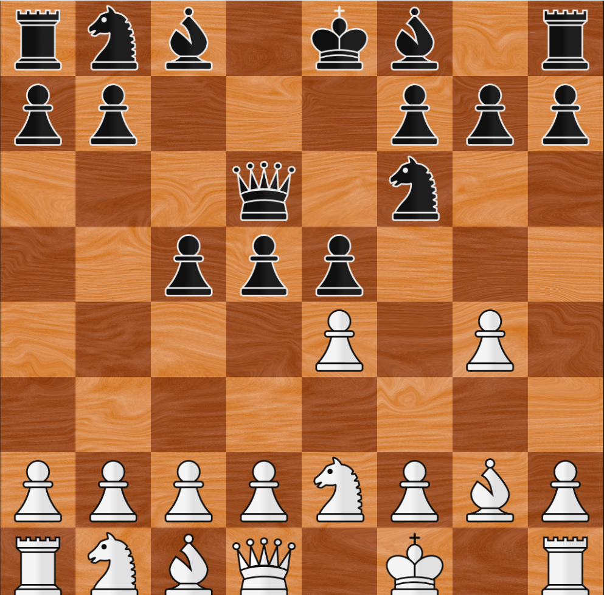
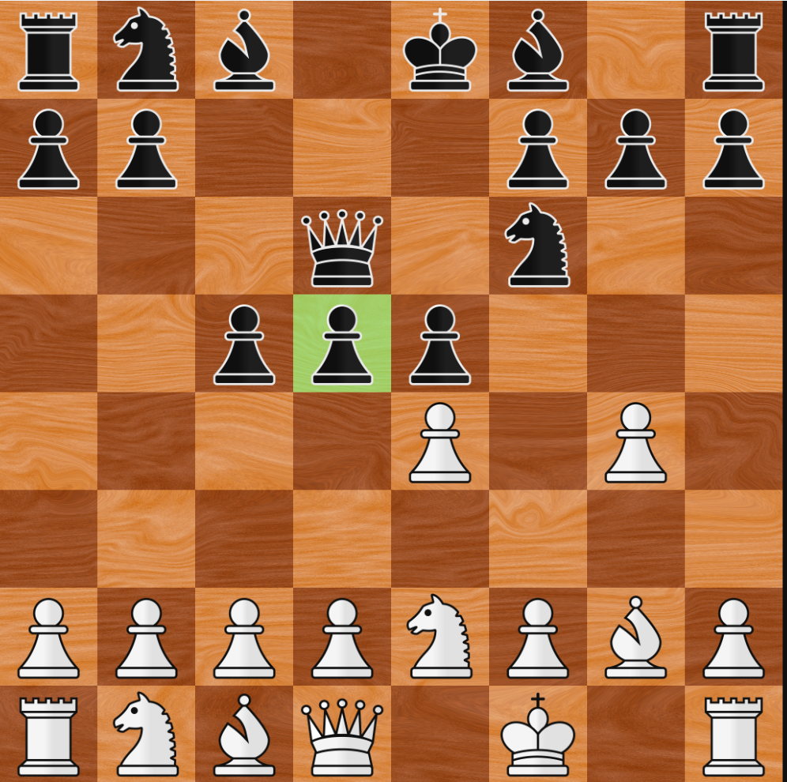
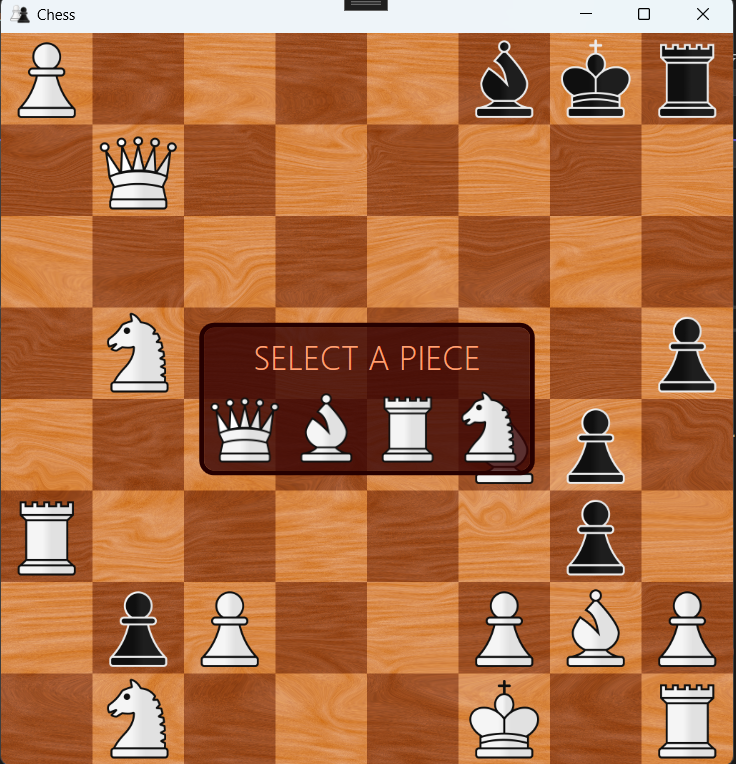
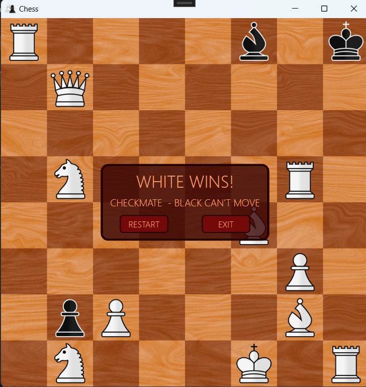

# ♟️ Satranç Oyunu (Chess Game)

Bu proje, **C#** ve **WPF (Windows Presentation Foundation)** kullanılarak geliştirilmiş, tam oynanabilir bir masaüstü satranç oyunudur. 

Modern ve kullanıcı dostu bir arayüze sahip olan bu uygulama, nesne yönelimli programlama (OOP) prensipleri kullanılarak tasarlanmıştır.

 Özellikler

* **Tam Satranç Kuralları:** Piyon terfisi (promotion), geçerken alma (en passant) ve rok (castling) dahil tüm standart satranç kuralları desteklenmektedir.
* **Oyun Durumu Kontrolü:** Şah çekme, şah mat ve pat durumlarını otomatik olarak algılar.
* **Görsel İpuçları:** Seçilen taşın gidebileceği geçerli hamleleri ekranda gösterir.
* **Modern Arayüz:** WPF ile tasarlanmış, akıcı ve temiz bir kullanıcı deneyimi sunar.

## 💻 Kullanılan Teknolojiler

* **Dil:** C#
* **Arayüz (UI):** WPF (Windows Presentation Foundation)
* **Geliştirme Ortamı:** Visual Studio

## Ekran Görüntüleri






## 🚀 Nasıl Çalıştırılır?

Projeyi kendi bilgisayarınızda çalıştırmak için şu adımları izleyebilirsiniz:

1. Bu depoyu bilgisayarınıza klonlayın veya `.zip` olarak indirin:
   ```bash
   git clone [https://github.com/KULLANICI_ADIN/Chess_Game.git](https://github.com/KULLANICI_ADIN/Chess_Game.git)
